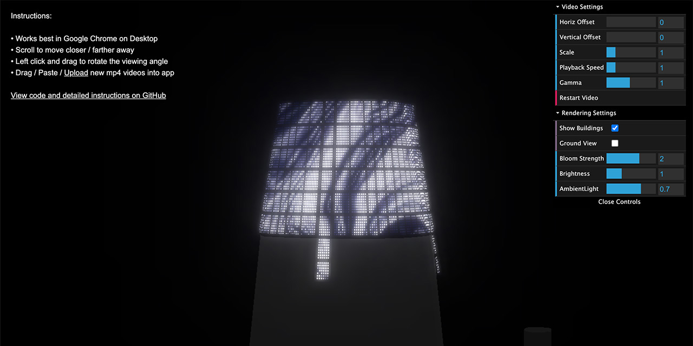

# salesforce-tower

3D visualization for artwork on Salesforce Tower, rendered with threejs using the bloom effect and some other custom shaders.

Live demo: [apps.amandaghassaei.com/salesforce-tower/](https://apps.amandaghassaei.com/salesforce-tower/)

## Import New Video

- Paste/drag .mp4 videos directly into webpage
- Ideally videos should have aspect ratio 256x70 (i.e. videos with dimensions 256x70, 512x140, 1024x280, etc. will fit perfectly), but other aspect ratios will work (see horizontal/vertical. offset controls to adjust the crop)
- Video must be type .mp4

## Controls

Orbit Controls:
- Scroll to move closer/farther away
- Left click and drag to rotate the viewing angle

Video Controls:
- "Horizontal/Vertical Offset" allows you to shift the position of the video on the screen
- "Scale" changes the zoom of the video, use in combination with horizontal/vertical offset to crop to a particular section of the video
- "Playback Speed" adjusts the rate of playback
- "Gamma" sets the gamma correction of the video
- "Restart Video" starts the video from the beginning
- Press spacebar to play/pause the video

Rendering Controls:
- Toggle "Show Buildings" to show/hide the surrounding buildings
- Toggle "Ground View" to place yourself on the ground or at the same level as the top of the tower
- "Bloom Strength" affects the glow coming off the LEDs
- "Brightness" sets the overall brightness of the LED display
- "Ambient Light Level" sets amount of ambient light on the surrounding buildings

## How 3D model was generated:

- Using [CADMapper](https://cadmapper.com/), select region to export and create a SketchUp .skp file.  The region I used was free to download.
- Open the .skp file in SketchUp and Select File > Export > 3D Model... Then select STL.
- The CADMapper geometry for Salesforce Tower wasn't quite right, so I deleted it and recreated it manually in threejs.
